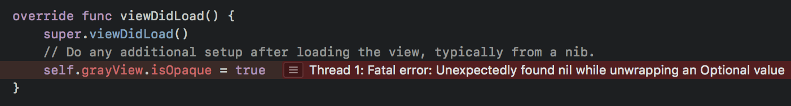
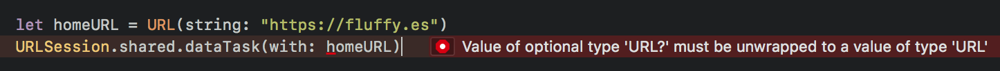
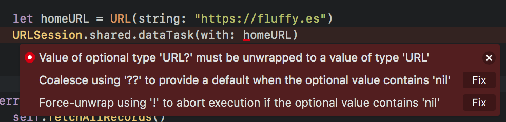

# Why do I keep getting "Thread 1: Fatal error: Unexpectedly found nil while unwrapping an Optional value" ?! Isn't Swift supposed to be easy?

You set out to learn how to program iOS apps, you downloaded Xcode and followed several online tutorials to learn iOS development and it seems to go well with the tutorials. But once you start coding on your own, you start noticing some weird looking symbols like :

1. **nameLabel: UILabel!**
2. **as! PersonTableViewCell** 
3. **name: String?**

It doesn't seem like a big deal until your app crashes and you are greeted with the scary "**Fatal error: Unexpectedly found nil while unwrapping an Optional value**" : 

You asked online and some people suggested using **if let** and **guard let** to prevent the crash, but what does these mean?! Some suggested to never use the "**!**" symbol in code but Xcode complains when you don't do so : 

You Googled online, found some articles which provide fixes, but you still don't understand why those fixes work , and you're back to square one the next time you are greeted with the same "Fatal error: Unexpectedly found nil" error again. Worse, some of those article are outdated and the Swift syntax is different and you end up with more errors.

And after a while, you just give up and use the "Fix" button provided by Xcode to make the error go away : 

Wouldn't it be good if those funky symbols ("?", "!") doesn't exist? Instead of spending hours fighting with errors, you could focus on the fun part - building features for your app! Unfortunately, optionals are there in Swift, and with good reason, there's no way to avoid it, but we can understand it, be friend with it and use it to our advantage when building features!

## What if you could focus on the fun part - building features ?

What if you are able to navigate through the symbols (**?** , **!** , **as!** ) easily? You could save hours trying to wrap your head around the errors and focus on your code. Imagine being able to indulge in building features you like and see the result appear in your phone, wouldn't that be great? 

You could finish the app idea that you have been wanting to work on, **submit it to the App Store**, and have a better resume for applying iOS developer positions.

## Understand how and why Optionals works and use it to your advantage

Optionals are there for a reason, it's to help your code to deal with uncertainty (eg: what happens if the expected data doesn't appear?).

When we don't understand how something works, we tend to get intimidated by it (eg: High school maths, how computer works, etc). But once we understand them, it will be easy to navigate around them and use it to help with our daily lives!

## Learn the purpose of Optionals, and how to use them to aide your app development process with Friendly Optionals Book

This book will cover :

1. Why Optionals exist?
2. How does Optionals work?
3. Unwrapping Optionals forcefully
4. How to handle optionals safely, using if let and etc
5. Providing default values when the expected values aren't there
6. Explaining various jargons (eg: optional binding, implicitly unwrapped optionals, etc)
7. Solving 'Unexpectedly found nil' error which relates to Storyboard UI (eg: nameLabel : UILabel! )
8. Using guard to make your code easier to understand

By the end of this book, you would be confident with dealing optionals, befriend with optionals and feel glad that Optionals exist! 😝

